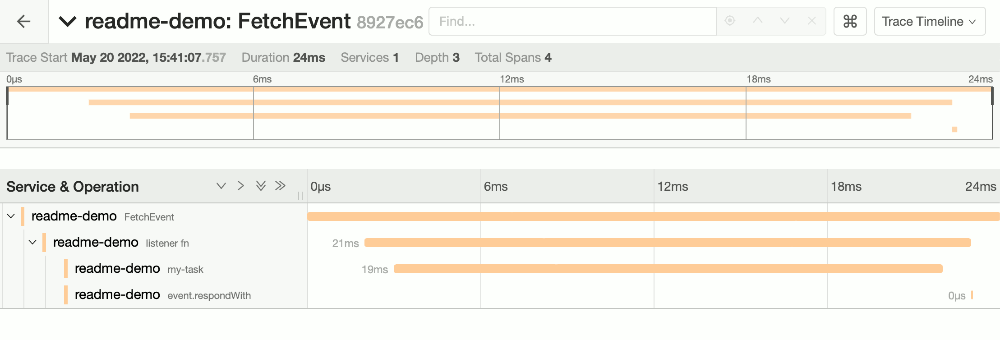

## OpenTelemetry for JavaScript on Compute@Edge

An implementation of the [OpenTelemetry JavaScript API](https://opentelemetry.io/docs/instrumentation/js/) for
[Fastly Compute@Edge](https://developer.fastly.com/learning/compute/).

Generate traces like this one to follow activity and time in your Compute@Edge applications:



**index.js**:

```javascript
/// <reference types="@fastly/js-compute" />

import './telemetry.js'
import { context, trace } from "@opentelemetry/api";

addEventListener("fetch", (event) => event.respondWith(handleRequest(event)));
async function handleRequest(event) {
  const tracer = trace.getTracerProvider()
    .getTracer('my-tracer');

  const mySpan = tracer.startSpan('my-task');
  context.with(trace.setSpan(context.active(), mySpan), () => {
    doTask();
  });
  mySpan.end();

  return new Response('OK', {
    status: 200,
    headers: new Headers({"Content-Type": "text/plain"}),
  });
}
```

**telemetry.js**:

```javascript
import { context, trace } from "@opentelemetry/api";
import { Resource } from "@opentelemetry/resources";
import { SemanticResourceAttributes } from "@opentelemetry/semantic-conventions";

import { FastlySDK } from "@fastly/compute-js-opentelemetry/sdk-fastly";
import { OTLPTraceExporter } from "@fastly/compute-js-opentelemetry/exporter-trace-otlp-fastly-backend";
import { getComputeJsAutoInstrumentations } from "@fastly/compute-js-opentelemetry/auto-instrumentations-compute-js";

const sdk = new FastlySDK({
  traceExporter: new OTLPTraceExporter({ backend: 'otlp-collector' }),
  instrumentations: [ getComputeJsAutoInstrumentations(), ],
  resource: new Resource({ [SemanticResourceAttributes.SERVICE_NAME]: 'readme-demo', }),
});
await sdk.start();
```

This implementation extends the standard interfaces and objects provided by the
OpenTelemetry [JavaScript API](https://github.com/open-telemetry/opentelemetry-js-api) and
[SDK](https://github.com/open-telemetry/opentelemetry-js), adapting them for use on the Fastly Compute@Edge platform.

Whereas `opentelemetry-js` would separate each concern into its own `npm` package,
we provide our components as a single package with multiple exports.

The table below provides links to the documentation for each module. 

| **Module**                                                                                                        | **Export Name**                                                                       | Description                                                                                                                                                                                                                                                                                                                                                                                                                                |
|-------------------------------------------------------------------------------------------------------------------|---------------------------------------------------------------------------------------|--------------------------------------------------------------------------------------------------------------------------------------------------------------------------------------------------------------------------------------------------------------------------------------------------------------------------------------------------------------------------------------------------------------------------------------------|
| [Fastly OpenTelemetry SDK](./src/opentelemetry-sdk-fastly)                                                        | `@fastly/compute-js-opentelemetry/opentelemetry-sdk-fastly`                           | A utility library that simplifies the initialization and coordination of OpenTelemetry components in use with a Compute@Edge JavaScript application.                                                                                                                                                                                                                                                                                       |
| [Fastly Compute@Edge JavaScript Lifecycle instrumentation](./src/opentelemetry-instrumentation-fastly-compute-js) | `@fastly/compute-js-opentelemetry/opentelemetry-instrumentation-fastly-compute-js`    | An [instrumentation](https://github.com/open-telemetry/opentelemetry-specification/blob/main/specification/glossary.md#instrumentation-library) implementation that generates traces for the Compute@Edge application lifecycle.                                                                                                                                                                                                           |
| [Fastly Backend Fetch instrumentation](./src/opentelemetry-instrumentation-fastly-backend-fetch)                  | `@fastly/compute-js-opentelemetry/opentelemetry-instrumentation-fastly-backend-fetch` | An [instrumentation](https://github.com/open-telemetry/opentelemetry-specification/blob/main/specification/glossary.md#instrumentation-library) implementation that generates traces for `fetch()` calls to Fastly backends.                                                                                                                                                                                                               |
| [Compute@Edge JavaScript auto-instrumentations](./src/auto-instrumentations-compute-js)                           | `@fastly/compute-js-opentelemetry/auto-instrumentations-compute-js`                   | A metapackage that automatically loads instrumentations for Compute@Edge JavaScript.                                                                                                                                                                                                                                                                                                                                                       |
| [Trace SDK for Fastly](./src/opentelemetry-sdk-trace-fastly)                                                      | `@fastly/compute-js-opentelemetry/opentelemetry-sdk-trace-fastly`                     | A utility library that provides a [Tracer Provider](https://open-telemetry.github.io/opentelemetry-js-api/interfaces/tracerprovider.html) and [Context Manager](https://open-telemetry.github.io/opentelemetry-js-api/interfaces/contextmanager.html) implementations for use with a Compute@Edge JavaScript application.                                                                                                                  |
| [Trace Exporter for Fastly backend](./src/exporter-trace-otlp-fastly-backend)                                     | `@fastly/compute-js-opentelemetry/exporter-trace-otlp-fastly-backend`                 | An [exporter](https://github.com/open-telemetry/opentelemetry-js/blob/main/doc/exporter-guide.md) implementation that exports traces using the [OTLP/HTTP JSON](https://github.com/open-telemetry/opentelemetry-specification/blob/main/specification/protocol/otlp.md#otlphttp) format [over a Fastly backend](https://developer.fastly.com/learning/compute/javascript/#communicating-with-backend-servers-and-the-fastly-cache).        |
| [Trace Exporter for Fastly named log provider](./src/exporter-trace-otlp-fastly-logger)                           | `@fastly/compute-js-opentelemetry/exporter-trace-otlp-fastly-logger`                  | An [exporter](https://github.com/open-telemetry/opentelemetry-js/blob/main/doc/exporter-guide.md) implementation that exports traces using the [OTLP/HTTP JSON](https://github.com/open-telemetry/opentelemetry-specification/blob/main/specification/protocol/otlp.md#otlphttp) format [over a Fastly named log provider](https://developer.fastly.com/learning/integrations/logging).                                                    |
| [Metrics SDK for Fastly](./src/opentelemetry-sdk-metrics-fastly)                                                  | `@fastly/compute-js-opentelemetry/opentelemetry-sdk-metrics-fastly`                   | A utility library that provides a [Metric Reader](https://opentelemetry.io/docs/reference/specification/metrics/sdk/#metricreader) implementation for use with a Compute@Edge JavaScript application.                                                                                                                                                                                                                                      |
| [Metrics Exporter for Fastly backend](./src/exporter-metrics-otlp-fastly-backend)                                 | `@fastly/compute-js-opentelemetry/exporter-metrics-otlp-fastly-backend`               | A [metric exporter](https://github.com/open-telemetry/opentelemetry-js/blob/main/doc/exporter-guide.md) implementation that exports metrics using the [OTLP/HTTP JSON](https://github.com/open-telemetry/opentelemetry-specification/blob/main/specification/protocol/otlp.md#otlphttp) format [over a Fastly backend](https://developer.fastly.com/learning/compute/javascript/#communicating-with-backend-servers-and-the-fastly-cache). |
| [Metrics Exporter for Fastly named log provider](./src/exporter-metrics-otlp-fastly-logger)                       | `@fastly/compute-js-opentelemetry/exporter-metrics-otlp-fastly-logger`                | A [metric exporter](https://github.com/open-telemetry/opentelemetry-js/blob/main/doc/exporter-guide.md) implementation that exports metrics using the [OTLP/HTTP JSON](https://github.com/open-telemetry/opentelemetry-specification/blob/main/specification/protocol/otlp.md#otlphttp) format [over a Fastly named log provider](https://developer.fastly.com/learning/integrations/logging).                                             |
| [Exporter Base Classes](./src/otlp-exporter-fastly-base)                                                          | `@fastly/compute-js-opentelemetry/otlp-exporter-fastly-base`                          | A base class for exporters, containing common code used by `@fastly/compute-js-opentelemetry/exporter-trace-otlp-fastly-backend` and `@fastly/compute-js-opentelemetry/exporter-trace-otlp-fastly-logger`.                                                                                                                                                                                                                                 |
| [Diagnostic Logger for Fastly named log provider](./src/diag-fastly-logger)                                       | `@fastly/compute-js-opentelemetry/diag-fastly-logger`                                 | A [DiagLogger](https://open-telemetry.github.io/opentelemetry-js-api/interfaces/diaglogger.html) implementation that logs to a [Fastly named log provider](https://developer.fastly.com/learning/integrations/logging).                                                                                                                                                                                                                    |
| [Webpack helpers](./src/webpack-helpers)                                                                          | `@fastly/compute-js-opentelemetry/webpack-helpers`                                    | A utility library that provides settings needed for use by [Webpack](https://webpack.js.org) as used by the build process of the Compute@Edge JavaScript application. Provides the shims and polyfills needed by the OpenTelemetry libraries.                                                                                                                                                                                              |
| [Core Utilities](./src/core) (Internal Use)                                                                       | (Not exported)                                                                        | Utilities intended to be used internally by the library.                                                                                                                                                                                                                                                                                                                                                                                   |

## Examples

See the examples in the [`/examples`](./examples) directory.

| **Example Directory**                                     | Description                                                                                                                                |
|-----------------------------------------------------------|--------------------------------------------------------------------------------------------------------------------------------------------|
| [readme-demo](./examples/readme-demo)                     | Example demo from the beginning of this README                                                                                             |
| [basic-tracing-example](./examples/basic-tracing-example) | Basic Tracing Example                                                                                                                      |
| [otel-demo](./examples/otel-demo)                         | Example that demonstrates OpenTelemetry traces that start at the Edge and nest into an operation at the backend.                           |
| [otel-http-proxy](./examples/otel-http-proxy)             | A sample application designed to collect traces as an HTTPS log endpoint for a Fastly service, sending them to an OpenTelemetry collector. |

## Webpack

Compute@Edge JavaScript applications are
[compiled as a web worker using Webpack](https://developer.fastly.com/learning/compute/javascript/#module-bundling) as
part of their build process. The [Compute@Edge starter kit for JavaScript](https://github.com/fastly/compute-starter-kit-javascript-default)
contains a Webpack configuration file that sets reasonable defaults for a starting point application.

In order to use the OpenTelemetry packages that we rely on, additions need to be made to this configuration,
for example the addition of polyfills and shims. These changes are included in a helper module, `@fastly/compute-js-opentelemetry/webpack-helpers`,
so that they may be applied as such:

```javascript
const webpackHelpers = require("@fastly/compute-js-opentelemetry/webpack-helpers");

module.exports = {
  entry: "./src/index.js",
  /* ... other configuration */
};

// Add this line
module.exports = webpackHelpers.apply(module.exports);
```

You are not required to use this module, but if you do choose not to use it, you will have to
make the appropriate modifications yourself. See [webpack-helpers](./src/webpack-helpers) for
details.

## Notes

### Environment Variables

OpenTelemetry defines a well-documented set of [environment variables](https://github.com/open-telemetry/opentelemetry-specification/blob/main/specification/sdk-environment-variables.md)
that are designed to allow you to configure defaults for its libraries. However, JavaScript applications built to run on
Fastly's Compute@Edge platform perform their upfront initialization at _build time ("build-time initialization")_ rather
than during each invocation (that's how they start up so fast). This means that the platform cannot provide a way to read
from the environment during build-time initialization, when most OpenTelemetry libraries are initializing.

Therefore, when using this library, the `getEnv()` function will always return the default values defined by OpenTelemetry.
Any changes you require to these defaults need to be made programmatically.

### Compatibility

Some `opentelemetry-js` modules are not currently compatible with Fastly Compute@Edge.
The table below is a non-comprehensive list of such components.

| **Component**                                                     | Package                                                                                                                             | Reason / Workaround                                                                                                                                                                                                                                            |
|-------------------------------------------------------------------|-------------------------------------------------------------------------------------------------------------------------------------|----------------------------------------------------------------------------------------------------------------------------------------------------------------------------------------------------------------------------------------------------------------|
| `BatchSpanProcessor`                                              | `@opentelemetry/sdk-trace-base`                                                                                                     | Relies on `setTimeout`. Use `FastlySpanProcessor`.                                                                                                                                                                                                             |
| `NodeSDK`                                                         | `@opentelemetry/sdk-node`                                                                                                           | Relies on `BatchSpanProcessor` as well as platforms detectors that are incompatible with Compute@Edge. Use `FastlySDK`.                                                                                                                                        |
| `OTLPTraceExporter`                                               | `@opentelemetry/exporter-trace-otlp-http`                                                                                           | Relies on `http` and `https`, which are not available in Compute@Edge. Use `OTLPTraceExporter` from `@fastly/compute-js-opentelemetry/exporter-trace-otlp-fastly-backend` or `@fastly/compute-js-opentelemetry/exporter-trace-otlp-fastly-logger` instead.     |
| `OTLPMetricExporter`                                              | `@opentelemetry/exporter-metrics-otlp-http`                                                                                         | Relies on `http` and `https`, which are not available in Compute@Edge. Use `OTLPTraceExporter` from `@fastly/compute-js-opentelemetry/exporter-metrics-otlp-fastly-backend` or `@fastly/compute-js-opentelemetry/exporter-metrics-otlp-fastly-logger` instead. |
| `ZoneContextManager`                                              | `@opentelemetry/context-zone`<br />`@opentelemetry/context-zone-peer-dep`                                                           | Relies on `zone.js`, which is incompatible with Compute@Edge. Use `FastlyStackContextManager`.                                                                                                                                                                 |
| `AsyncHooksContextManager`<br />`AsyncLocalStorageContextManager` | `@opentelemetry/context-async-hooks`                                                                                                | Relies on `async_hooks`, which is not available in Compute@Edge. Use `FastlyStackContextManager`.                                                                                                                                                              |
| Instrumentations included in `opentelemetry-js`                   | `@opentelemetry/instrumentation-*`<br />`@opentelemetry/auto-instrumentations-node`<br />`@opentelemetry/auto-instrumentations-web` | These rely on other frameworks and modules that are not compatible with Compute@Edge. Use `FastlyComputeJsInstrumentation` and `FastlyBackendFetchInstrumentation`.                                                                                            |

## Issues

If you encounter any non-security-related bug or unexpected behavior, please [file an issue][bug]
using the bug report template.

[bug]: https://github.com/fastly/compute-js-opentelemetry/issues/new?labels=bug

### Security issues

Please see our [SECURITY.md](./SECURITY.md) for guidance on reporting security-related issues.

## License

[MIT](./LICENSE).
