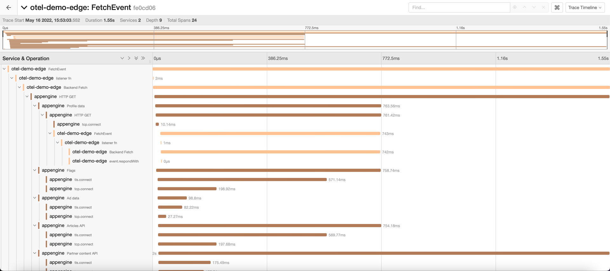

# OpenTelemetry Demo

This directory includes two programs that can be executed together to demonstrate
OpenTelemetry's ability to create traces that illustrate the progress of an operation,
including context propagation into child processes.

It also demonstrates the optional use of [`otel-http-proxy`](../otel-http-proxy) example
application for using a named log provider to send traces.  

## Components

* [`./edge`](./edge) - Edge Application "edge"

  The Compute@Edge JavaScript application that serves as the entry point of the
  demo. Calling this application normally calls the "appengine" backend, described below,
  returning the body from that backend.

  This application can also be invoked at the special `/json` path, in which case it will
  call `https://httpbin.org/json` and return the body from that response.

  This app uses `FastlyJsInstrumentation`, so Compute@Edge lifecycle events and the
  backend fetch will generate OpenTelemetry traces.

  This application uses the Trace Exporter from `@fastly/compute-js-opentelemetry/exporter-trace-otlp-fastly-backend`,
  and sends its traces to an OpenTelemetry collector.

  Alternatively, this application can be configured to use the Trace Exporter from
  `@fastly/compute-js-opentelemetry/exporter-trace-otlp-fastly-logger` and send its traces to a named
  log provider.

* [`./appengine`](./appengine) - Backend Application "appengine"

  A Node.js [Express](https://expressjs.com/) application that makes outgoing requests to a
  number of URLs, generating OpenTelemetry spans for each request. Afterwards, it returns
  the string `"OK!"`.

  One of the URLs that is called is the Edge Application described above, at the special
  path `/json`.

  This app uses the instrumentations from `@opentelemetry/auto-instrumentations-node`,
  which includes instrumentations for Express and http. As such it will create OpenTelemetry
  traces for the express lifecycle, as well as for the outgoing http requests to make the outgoing
  requests.

  All the OpenTelemetry traces generated by this application are sent directly to the
  OpenTelemetry Collector.

  This application demonstrates propagation: The Edge App provides the active context
  as it calls "appengine" (downstream propagation), and "appengine" picks up that context
  and uses it for the root of all traces it generates (upstream propagation); additionally,
  "appengine" injects the active context as it makes its outgoing calls (downstream propagation),
  and when the Edge Application responds to one of these requests, it picks up that context
  and uses it for the root of the traces it generates in that invocation (upstream propagation).

## Requirements

This demo is designed for the Edge Application to run in a Fastly Compute@Edge service, and for
the "appengine" application running at publicly available endpoint.

You will also need an OpenTelemetry collector that will receive the emitted traces. This demo has
been tested against the
[OpenTelemetry Collector Demo](https://github.com/open-telemetry/opentelemetry-collector-contrib/tree/main/examples/demo).

For testing purposes, you may run "appengine" (as well as your OpenTelemetry collector) on your
local machine and make it (them) publicly available by using a reverse proxy tool such as [ngrok](https://ngrok.com).

## Running the application

1. Configure your Fastly service

Build the `edge` application and deploy it to your Fastly service, for example by using
[`fastly compute publish`](https://developer.fastly.com/reference/cli/compute/publish/).

Configure your Fastly service with three backends:

| Backend name   | Configuration                                   |
|----------------|-------------------------------------------------|
| `appengine`    | public hostname of your "appengine" instance    |
| `otel-backend` | public hostname of your OpenTelemetry collector |
| `httpbin`      | `httpbin.org`                                   |

Configure an [Edge Dictionary](https://docs.fastly.com/en/guides/about-dictionaries) named `config` with the following
values:

| Key                       | Description                                                            | Default Value                                                         |
|---------------------------|------------------------------------------------------------------------|-----------------------------------------------------------------------|
| `APPENGINE_URL`           | URL of your "appengine" instance                                       | (required - URL must have the hostname of the "application" backend)  | 
| `OTEL_HTTP_COLLECTOR_URL` | The trace collection URL of the OpenTelemetry collector                | (required - URL must have the hostname of the "otel-backend" backend) |
| `TRACE_EXPORTER_TYPE`     | _(optional)_ The type of trace exporter to use - `backend` or `logger` | `backend`                                                             |

2. Configure the "appengine" application.

Copy `sample.env` to `.env` and make changes. Each key that is not given a
value receives the default value listed below.

| Variable                  | Description                                                                                                        | Default                           |
|---------------------------|--------------------------------------------------------------------------------------------------------------------|-----------------------------------|
| `EDGE_APP_URL`            | Public URL of your Edge application. This is needed because this application calls back into the Edge application. | `http://localhost:7676/`          |
| `PORT`                    | The port to run this application                                                                                   | `3000`                            |
| `OTEL_HTTP_COLLECTOR_URL` | The trace collection URL of the OpenTelemetry collector                                                            | `http://localhost:4318/v1/traces` |

3. Install dependencies for "appengine".

```shell
yarn
```

4. Run "appengine".

```shell
yarn start
```

5. Browse to your Edge application

6. Check OpenTelemetry traces

If you're using a local instance of OpenTelemetry Collector Demo, then browse to Jaeger UI, which is running at 
http://0.0.0.0:16686/. Select `otel-demo` from the `Service` dropdown, and then click `Find Traces` to find your trace.

## Using a named log provider to collect traces (optional)

The Edge application can be configured to send traces using a named log provider instead of
directly to the OpenTelemetry collector. This is more performant for the Edge application,
because it outputs to [Fastly real-time log streaming](https://docs.fastly.com/en/guides/about-fastlys-realtime-log-streaming-features)
freeing your Compute@Edge application from having to book its own network request.

To do this, you will also need to have an instance of the [`otel-http-proxy`](../otel-http-proxy)
example application running at a publicly available endpoint.

Additionally, your Fastly service will need to be configured with a named log provider called
`otel_http_proxy` that outputs to an HTTPS endpoint, set to `POST` its logs to the public URL of
your `otel-http-proxy` instance.  For testing purposes, you may run it on your local machine and
make it publicly available by using a reverse proxy tool such as [ngrok](https://ngrok.com).

Finally, in the `config` Edge Dictionary, set the value of the `TRACE_EXPORTER_TYPE` key to `logger`.

## Use with Compute@Edge local test server

It's possible to run this demo locally as well, by running the Edge application under the
[Compute@Edge local test server](https://developer.fastly.com/learning/compute/testing/#running-a-local-testing-server),
and the "appengine" and the OpenTelemetry collector locally.

Note that it is not possible to use a named log provider when running the Edge application under
this scenario.

1. Configure the Edge application

Copy `config.sample.json` to `config.json` and make changes. Each key that is not given a value receives
the default value listed below.

| Key                       | Description                                                            | Default Value                     |
|---------------------------|------------------------------------------------------------------------|-----------------------------------|
| `APPENGINE_URL`           | URL of your "appengine" instance                                       | `http://localhost:3000/`          | 
| `OTEL_HTTP_COLLECTOR_URL` | The trace collection URL of the OpenTelemetry collector                | `http://localhost:4318/v1/traces` |

The service's backends are defined as follows. Modify them under the `[local_server.backends]` section of the `fastly.toml` file
if you need to make changes.

| Backend name   | Hostname Configuration   |
|----------------|--------------------------|
| `appengine`    | `http://localhost:3000/` |
| `otel-backend` | `http://localhost:4318/` |
| `httpbin`      | `https://httpbin.org/`   |

2. Configure the "appengine" application.

Copy `sample.env` to `.env` and make changes. Each key that is not given a
value receives the default value listed below.

| Variable                  | Description                                                                                                        | Default                           |
|---------------------------|--------------------------------------------------------------------------------------------------------------------|-----------------------------------|
| `EDGE_APP_URL`            | Public URL of your Edge application. This is needed because this application calls back into the Edge application. | `http://localhost:7676/`          |
| `PORT`                    | The port to run this application                                                                                   | `3000`                            |
| `OTEL_HTTP_COLLECTOR_URL` | The trace collection URL of the OpenTelemetry collector                                                            | `http://localhost:4318/v1/traces` |

3. Install dependencies for "appengine".

```shell
yarn
```

4. Run "appengine".

```shell
yarn start
```

5. Browse to your Edge application

6. Check OpenTelemetry traces

If you're using a local instance of OpenTelemetry Collector Demo, then browse to Jaeger UI, which is running at
http://0.0.0.0:16686/. Select `otel-demo-edge` from the `Service` dropdown, and then click `Find Traces` to find your trace.

You will need to configure the Edge application by modifying `config.json` to
configure the Edge Dictionary.

## Example Output

The following screenshot is an example trace generated by calling the Edge Application.
This screenshot illustrates the spans that are created and that traces created by each
application are colored differently but appropriately nested.



Note that although the various spans created by the Edge application and "appengine" reach
the collector via separate routes, the collector is able to combine all the data into a
single coherent trace.

In a complex operation whose individual parts take place in various distributed components,
those components are able to individually report their partial telemetry data to the collector.
The collector is then able to piece together all the traces into a usable form.
